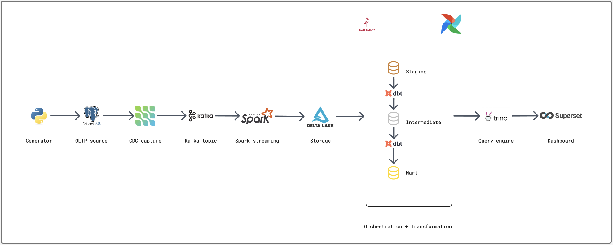

# TheLook E-commerce Lakehouse

[](https://www.python.org/)
[](https://docs.docker.com/compose/)
[](https://airflow.apache.org/)
[](https://www.getdbt.com/)
[](#)
[](https://kafka.apache.org/)
[](https://debezium.io/)
[](https://spark.apache.org/)
[](https://delta.io/)
[](https://min.io/)
[](https://trino.io/)
[](https://superset.apache.org/)

A streaming data lakehouse built on the **TheLook E-commerce** dataset, following the **Medallion Architecture**. The platform captures real-time product, order, and user events from PostgreSQL via Debezium CDC into Kafka, processes them through Spark Structured Streaming onto Delta Lake (MinIO), and serves business-ready metrics through Trino and Superset dashboards — all orchestrated by Airflow and dbt.

---

## Table of Contents

1. [Overview](#1-overview)
2. [Problem Statement & Goals](#2-problem-statement--goals)
3. [Architecture](#3-architecture)
4. [Data Modeling](#4-data-modeling)
5. [Key Features](#5-key-features)
6. [Quick Start](#6-quick-start)
7. [Tech Stack](#7-tech-stack)
8. [Project Structure](#8-project-structure)
9. [Service Endpoints](#9-service-endpoints)
10. [Dashboards](#10-dashboards)
11. [Future Roadmap](#11-future-roadmap)

---

## 1. Overview

TheLook E-commerce is a self-contained data lakehouse that simulates a modern e-commerce platform's data infrastructure. The system ingests real-time transaction data (orders, items, users, events, products) from a PostgreSQL source via Debezium CDC into Kafka, then processes and serves it across three analytical layers following the Medallion Architecture:

- **Bronze (staging):** Raw CDC events from Kafka — flat JSON records with typed columns, no Debezium envelope (`operation`, `before`/`after`) in the wire format.
- **Silver (intermediate):** Deduplicated, cleaned, and type-corrected data — one record per entity key.
- **Gold (mart):** Business-ready dimension and fact tables — customer segments, order metrics, product performance, session funnels.

The serving layer uses Trino to query Delta Lake tables directly via Hive Metastore, and Superset for BI dashboards.

---

## 2. Problem Statement & Goals

### The Challenge

E-commerce platforms generate high-velocity, heterogeneous data streams — user events, orders, product updates, inventory changes — that traditional batch ETL cannot capture with sufficient freshness. Meanwhile, analysts need up-to-date customer segments, product performance metrics, and cohort analysis without impacting the operational database.

### Project Goals

- **Real-time CDC Ingestion:** Capture every insert, update, and delete from PostgreSQL WAL via Debezium into Kafka with millisecond latency.
- **Streaming-first Lakehouse:** Use Spark Structured Streaming to write incremental micro-batches to Delta Lake on MinIO, decoupling storage from compute.
- **Medallion Data Quality:** Progress data through three quality tiers (staging → intermediate → mart) with deduplication, type enforcement, and business logic.
- **SQL-first Serving:** Enable ad-hoc and dashboard queries via Trino on Delta Lake, without duplicating data into a separate serving database.
- **Automated Orchestration:** Orchestrate the entire pipeline (data generation → CDC → streaming → dbt transformations → serving) with Airflow DAGs.

### Key Business Questions

The platform is designed to answer:

**Customer Intelligence**
- Who are the high-value customers, and what drives their lifetime value?
- How do customer cohorts behave over time (retention, repeat purchases)?
- What is the funnel from session → cart → order?

**Product Performance**
- Which products drive the most revenue? Which are underperforming?
- How does product mix vary by category, brand, and price tier?

**Operational Analytics**
- What is the daily order volume and revenue trend?
- How does fulfillment performance vary by distribution center?
- What is the session-level event funnel (page views → add to cart → checkout)?

---

## 3. Architecture



Data flow:
1. **Generator** writes e-commerce events (orders, users, products, events) into PostgreSQL.
2. **Debezium** captures CDC from PostgreSQL WAL (pgoutput plugin) and publishes JSON to Kafka topics (`thelook.public.*`).
3. **Spark Structured Streaming** consumes Kafka, parses JSON via `from_json()`, writes to Delta Bronze (staging).
4. **Airflow + dbt** automates: `staging` (ephemeral dedup) -> `intermediate` (incremental merge) -> `mart` (dim + fact tables). Results written back to Delta Lake.
5. **Trino** wraps all 3 layers — queries staging for raw CDC, intermediate for enriched data, mart for business metrics. **Superset** renders dashboards.

---

## 4. Data Modeling

The analytical schema follows a **star schema** pattern optimized for BI queries:

- **Dimensions:** `dim_customers`, `dim_products`, `dim_date` — slowly changing attributes, customer tiers, product price tiers.
- **Facts:** `fct_orders`, `fct_order_items`, `fct_events`, `fct_sessions` — atomic transactions and events at the grain of order, item, and session.

Key modeling decisions:
- `event_ts_ms` (epoch milliseconds from Debezium) is the watermark/dedup key — not business timestamps.
- `created_at` columns in orders are epoch **seconds** — requires division by 1000 before casting to timestamp.
- `dim_customers` uses a `changed_users` watermark CTE: only recalculates customers with CDC events since the last run, preserving SCD semantics without full table rewrite.
- `dim_date` is a static date spine (2020–2030) generated via `UNNEST(sequence(...))` at Trino runtime.

---

## 5. Key Features

- **Real-time CDC Pipeline**
  Debezium captures every row-level change from PostgreSQL WAL using the `pgoutput` plugin. The `ExtractChangedRecord` SMT unwraps the Debezium CDC envelope, producing flat JSON records on the wire with fields: `op`, `ts_ms`, `after` (the changed row). Each Kafka topic (`thelook.public.*`) contains JSON records.

- **Spark Structured Streaming**
  Spark 3.5 reads from Kafka using the `kafka` source, parses JSON using `from_json()` with locally-defined StructTypes (schemas from `.avsc` files as reference), and writes micro-batches to Delta Lake on MinIO every trigger interval. Checkpointing ensures exactly-once semantics across restarts.

- **Delta Lake on MinIO**
  All layers (staging, intermediate, mart) use Delta Lake format, providing ACID transactions, schema enforcement, and time-travel capabilities on S3-compatible object storage.

- **Hive Metastore + Trino**
  Hive Metastore 4.1 manages table metadata (schema, partitioning, location) for all Delta tables. Trino serves as the SQL query engine, federating queries across all three medallic schemas (`staging`, `intermediate`, `mart`) without data duplication.

- **dbt Transformations**
  dbt 1.7 models implement the intermediate and mart layers. Materialization strategies: `ephemeral` for staging models (CTEs only), `incremental` with `delete+insert` merge for intermediate models, and `table` with `on_table_exists: drop` for mart models. Tests enforce data quality (not-null, unique, relationship, accepted values, range bounds).

- **Airflow Orchestration**
  Airflow 3.0 DAGs orchestrate the full pipeline: data generation → CDC capture → Spark streaming → dbt transformation → data freshness checks. Cosmos provider enables native dbt integration with Airflow.

- **Data Generator**
  A Python-based synthetic data generator produces realistic TheLook e-commerce events (orders, items, users, products, events, sessions) and inserts them into PostgreSQL, triggering CDC events downstream.

---

## 6. Quick Start

### Prerequisites

- **Docker & Docker Compose v2**
- **RAM:** 8GB minimum (16GB+ recommended)
- **Ports:** 5432, 9092, 8083, 8085, 8088, 8089, 8090, 8091, 9000, 9001, 9083

### Start Services

```bash
make up-core           # Core services (Postgres, Kafka, Spark, MinIO, Trino, HMS)
make up-datagen        # + data generator
make up-airflow        # + Airflow + dbt
make up-explore        # + JupyterLab
make up-all            # Everything (core + datagen + explore + airflow)
make down              # Stop all
make ps                # Show running containers
```

### Run dbt

```bash
make build-dbt         # Build dbt image (first time only)
make ps                # Wait for services healthy, then:
docker compose exec dbt dbt run --project-dir /dbt --profiles-dir /dbt
```

---

## 7. Tech Stack

| Category | Technology | Version | Purpose |
|---|---|---|---|
| Source DB | PostgreSQL | 15 | Core OLTP database with WAL enabled for CDC |
| CDC | Debezium | 3.0 | Capture row-level changes from PostgreSQL WAL |
| Message Broker | Apache Kafka | 3.9 (KRaft) | Decouple ingestion from downstream processing |
| Stream Processing | Apache Spark | 3.5.6 | Structured Streaming from Kafka to Delta Lake |
| Table Format | Delta Lake | 3.0 | ACID storage, schema enforcement, time travel |
| Object Storage | MinIO | latest | S3-compatible data lake storage |
| Metastore | Hive Metastore + MariaDB | 4.1 / 10.5 | Table metadata management |
| Query Engine | Trino | latest | SQL query engine on Delta Lake |
| Orchestration | Apache Airflow + dbt | 3.0 / 1.7 | Pipeline scheduling and transformation management |
| Visualization | Apache Superset | 3.1 | BI dashboards |
| Notebook | JupyterLab | latest | Interactive data exploration |

---

## 8. Project Structure

```
.
├── static/                    # Static assets (architecture diagram, etc.)
├── workspace/                  # Jupyter notebooks (Spark streaming, exploration)
├── data-generator/             # Synthetic TheLook e-commerce data generator
├── infra/
│   ├── airflow/              # Airflow configuration and DAGs
│   ├── spark/                # Spark cluster (master + worker) + config
│   ├── hive-metastore/       # Hive Metastore + MariaDB backend
│   ├── kafka/                # Kafka KRaft broker configuration
│   ├── debezium/             # Debezium CDC connector configs
│   ├── trino/                # Trino query engine config
│   ├── superset/             # Apache Superset BI config
│   ├── jupyter-lab/          # JupyterLab + Hive 4.1 client + schemas
│   └── dbt/                  # dbt project (models, tests, macros, profiles)
│       └── models/
│           ├── staging/      # Bronze — raw CDC passthrough (ephemeral)
│           ├── intermediate/ # Silver — deduplication & cleaning (incremental)
│           └── mart/         # Gold — dimensions & facts (table)
├── docker-compose.yaml         # Service orchestration
├── Makefile                    # Convenience commands
└── .env                       # Environment variables
```

---

## 9. Service Endpoints

| Service | URL | Credentials |
|---|---|---|
| Spark Master UI | http://localhost:8088 | — |
| JupyterLab | http://localhost:8888 | — |
| MinIO Console | http://localhost:9001 | minio / minio123 |
| Trino UI | http://localhost:8080 | — |
| Apache Superset | http://localhost:8089 | admin / admin123 |
| Debezium REST API | http://localhost:8083 | — |
| Apache Airflow | http://localhost:8085 | admin / admin123 |
| Kafka | localhost:9092 | — |

---

## 10. Dashboards

> Screenshots available in `static/` directory.

---

## 11. Future Roadmap

### Infrastructure & Scalability

- **Cloud Migration:** Transition from local Docker to managed cloud services (AWS EMR/MSK/S3, GCP Dataproc/PubSub/GCS, or Azure Synapse/Spark).
- **Infrastructure as Code:** Terraform or Pulumi to provision cloud resources programmatically.
- **Multi-region Replication:** Kafka MirrorMaker for cross-region CDC event replication.

### Data Engineering

- **Real-time Serving:** Replace batch dbt with streaming aggregations (Spark Structured Streaming aggregations, Flink for complex event processing).
- **Unified Serving Layer:** Migrate from per-layer schema queries to Apache Iceberg for time-travel queries across layers.
- **Advanced Analytics:** Customer lifetime value modeling, product recommendation engine, anomaly detection for fraud signals.

### DevOps & Observability

- **CI/CD:** GitHub Actions for automated linting (Ruff/Black), dbt tests, Docker image building.
- **Data Contracts:** Great Expectations or dbt Data Tests for declarative data quality enforcement at each medallic layer.
- **Monitoring:** Prometheus + Grafana for Kafka lag, Spark job metrics, and Trino query performance. Slack alerting for Airflow DAG failures.
- **Data Catalog:** Apache Atlas or OpenMetadata for data lineage, column-level documentation, and discovery.
