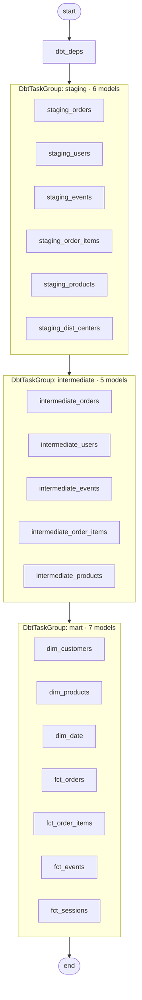

# Airflow — Pipeline Orchestration

**File:** `infra/airflow/dags/thelook_pipeline_dag.py`

## DAG Graph



## DAG Definition

```python
# infra/airflow/dags/thelook_pipeline_dag.py
with DAG(
    dag_id="thelook_dbt_pipeline",
    schedule="0 23 * * *",        # 11:00 PM daily
    start_date=datetime(2024, 1, 1),
    catchup=False,
    default_args={"owner": "airflow", "retries": 2},
    tags=["thelook", "dbt", "lakehouse"],
) as dag:

    staging = DbtTaskGroup(
        group_id="staging",
        project_config=project_config,
        profile_config=profile_config,
        execution_config=execution_config,
        render_config=RenderConfig(
            load_method=LoadMode.DBT_MANIFEST,
            test_behavior=TestBehavior.AFTER_EACH,
            select=["path:models/staging"],
        ),
    )
```

## Cosmos Configuration

```python
project_config = ProjectConfig(
    dbt_project_path=Path("/opt/airflow/dbt"),
    project_name="thelook_lakehouse",
    install_dbt_deps=False,               # dbt_deps task handles this
    manifest_path=DBT_PROJECT_PATH / "target" / "manifest.json",
)

profile_config = ProfileConfig(
    profile_name="thelook_trino",
    target_name="dev",
    profiles_yml_filepath=DBT_PROJECT_PATH / "profiles.yml",
)

execution_config = ExecutionConfig(
    execution_mode=ExecutionMode.LOCAL,    # dbt runs inside Airflow container
    dbt_executable_path="/opt/dbt_venv/bin/dbt",
)
```

| Config | Value | Meaning |
|--------|-------|---------|
| `load_method=DBT_MANIFEST` | Cosmos reads `target/manifest.json` to build task graph | dbt deps must run first |
| `test_behavior=AFTER_EACH` | Tests run after each model | Failure stops downstream |
| `execution_mode=LOCAL` | dbt runs inside the Airflow container | No separate runner needed |

## Airflow Session Fix

Airflow 3.0 defaults to database session backend, causing CSRF race conditions with SQLite. Fixed in `docker-compose.yaml`:

```yaml
AIRFLOW__WEBSERVER__SESSION_BACKEND: securecookie
AIRFLOW__WEBSERVER__SESSION_COOKIE_SECURE: "False"
AIRFLOW__WEBSERVER__SESSION_COOKIE_SAMESITE: "Lax"
```

## Cookie Conflict with Superset

Both Airflow and Superset use Flask-AppBuilder (FAB), defaulting to `SESSION_COOKIE_NAME=session`. When open in the same browser, they overwrite each other's sessions.

**Workaround:** access one service in incognito/private window.

## Running Manually

```bash
# Trigger DAG
docker compose exec airflow-webserver \
  airflow dags trigger thelook_dbt_pipeline

# Monitor runs
docker compose exec airflow-webserver \
  airflow dags list-runs -d thelook_dbt_pipeline

# View task logs
docker compose exec airflow-webserver \
  airflow tasks logs thelook_dbt_pipeline staging.staging_orders 1
```

## Running dbt Without Airflow

```bash
# All models
docker compose exec dbt dbt run --project-dir /dbt --profiles-dir /dbt

# Run + test
docker compose exec dbt dbt run --project-dir /dbt --profiles-dir /dbt && \
  dbt test --project-dir /dbt --profiles-dir /dbt

# Specific layer
docker compose exec dbt dbt run --project-dir /dbt --profiles-dir /dbt \
  --select path:models/intermediate

# Full refresh (mart tables)
docker compose exec dbt dbt run --project-dir /dbt --profiles-dir /dbt \
  --full-refresh --select path:models/mart
```

## Docker Compose Profiles

| Profile | Services |
|---------|---------|
| `core` | postgres, minio, kafka, debezium, spark, trino, hms, jupyter-lab |
| `datagen` | data-generator |
| `explore` | jupyter-lab (duplicates `core`) |
| `airflow` | airflow-scheduler, airflow-webserver, airflow-db, dbt, superset |

```bash
make up-airflow     # Start Airflow + Superset + dbt
make up-all         # Everything
```
