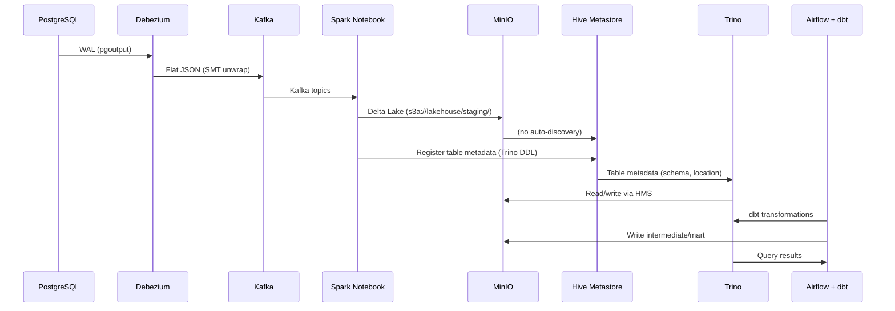
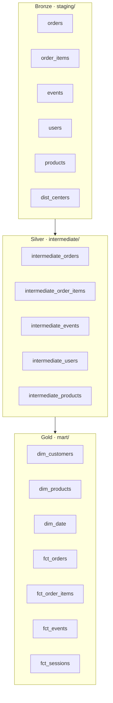

# Architecture

## System Overview

TheLook is a **streaming data lakehouse** that ingests e-commerce events from PostgreSQL via Debezium CDC into Kafka, processes them through Spark Structured Streaming onto Delta Lake (MinIO), and serves business-ready metrics through Trino and Superset — all orchestrated by Airflow and dbt.

## Data Flow



## Three-Layer Architecture (Medallion)



### Layer Responsibilities

| Layer | dbt materialization | Path | Responsibility |
|-------|---------------------|------|----------------|
| **staging/** | `ephemeral` | `s3a://lakehouse/staging/` | Raw typed CDC, no dedup |
| **intermediate/** | `incremental` | `s3a://lakehouse/intermediate/` | Deduplication + enrichment |
| **mart/** | `table` | `s3a://lakehouse/mart/` | Star schema dims + facts |

## Docker Services

| Service | Role | Key Config |
|---------|------|------------|
| `postgres` | OLTP source + CDC WAL | `wal_level=logical`, pgoutput plugin |
| `kafka` | Message broker | KRaft mode, topics: `thelook.public.*` |
| `debezium` | CDC connector | `ExtractChangedRecord` SMT, JSON converter |
| `spark-master` / `spark-worker` | Cluster mode | Spark 3.5 |
| `jupyter-lab` | Notebook runtime | pyspark-notebook 3.5 + Hive 4.1.0 client + Delta 3.0 |
| `hive-metastore` | Metadata registry | HMS 4.1.0 + MariaDB backend |
| `trino` | Query engine | Delta Lake connector |
| `minio` | Object storage | S3-compatible |
| `data-generator` | Writes to PostgreSQL | Python 3.11 |
| `airflow-scheduler` / `airflow-webserver` | Orchestration | Airflow 3.0 + Cosmos |
| `superset` | BI dashboards | Apache Superset 3.1.3 |

All services communicate over `data_network` using Docker DNS names.

## Key Design Decisions

### 1. HMS Must Be Explicitly Registered

Hive Metastore is a **metadata registry**, not a discovery engine. It does NOT auto-discover tables written by Spark to MinIO. Two registration paths exist:

```python
# Notebook registers staging tables (cells 4-5)
trino_exec("CREATE TABLE IF NOT EXISTS delta.staging.events ... WITH (location = 's3a://lakehouse/staging/events')")

# dbt hook ensures schemas exist before table creation
# infra/dbt/dbt_project.yml on-run-start:
#   CREATE SCHEMA IF NOT EXISTS staging WITH (location = 's3a://lakehouse')
#   CREATE SCHEMA IF NOT EXISTS intermediate WITH (location = 's3a://lakehouse')
#   CREATE SCHEMA IF NOT EXISTS mart WITH (location = 's3a://lakehouse')
```

> **Why?** Without explicit paths, Trino auto-creates schemas at `s3a://lakehouse/warehouse/` (its default). HMS stores metadata pointing there, but notebook writes to `lakehouse/`. Result: `DELTA_LAKE_INVALID_SCHEMA: Metadata not found`.

### 2. Two-Layer CDC Deduplication

Deduplication happens in two stages:

1. **Staging → Intermediate:** `ROW_NUMBER() OVER (PARTITION BY id ORDER BY kafka_ts DESC) = 1` — keeps latest record per entity
2. **Intermediate:** `delete+insert` on `unique_key` — replaces old records with new ones incrementally

### 3. Timestamp Strategy

| Field | Source | Usage |
|-------|--------|-------|
| `kafka_ts` | Kafka message metadata | Watermark for dedup + incremental filtering |
| `created_at`, `shipped_at`, etc. | ISO-8601 strings from Debezium | Cast with `CAST(col AS TIMESTAMP)` in mart |

### 4. Ghost Events

Events with `user_id IS NULL` (anonymous browsing) get `is_ghost=true` in `intermediate_events`. These are excluded from session aggregations but tracked in raw event counts.

