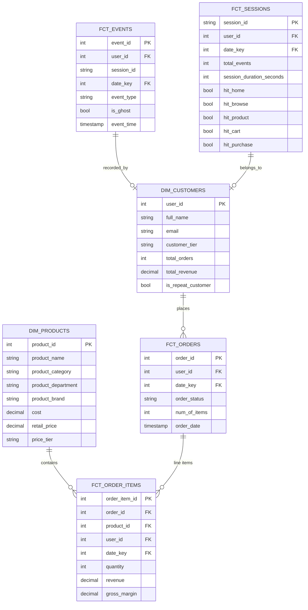

# Data Model — Star Schema

## Schema Overview

Three medallic layers produce a **star schema** optimized for BI queries:

| Layer | Schema | Tables | Materialization | Purpose |
|-------|--------|--------|----------------|---------|
| Bronze | `delta.staging` | 6 | `ephemeral` | Raw typed CDC records |
| Silver | `delta.intermediate` | 5 | `incremental` | Deduplicated, enriched entities |
| Gold | `delta.mart` | 7 | `incremental` / `table` | Business-ready dims + facts |

## Entity Relationship Diagram



`dim_date` (date_key → date attributes) joins all fact tables.

---

## Staging Layer — `delta.staging`

Raw typed columns from Spark notebook. Deduplication via `ROW_NUMBER()` window keyed on CDC key + watermark.

| Table | CDC key | Watermark | Dedup |
|-------|---------|-----------|-------|
| `orders` | `id` | `kafka_ts` | Yes |
| `order_items` | `id` | `kafka_ts` | Yes |
| `events` | `id` | `kafka_ts` | No (append-only) |
| `users` | `id` | `kafka_ts` | Yes |
| `products` | `id` | `event_ts_ms` | Yes |
| `dist_centers` | `id` | `event_ts_ms` | Yes |

> **Note:** `events` is append-only — no dedup at staging because late-arriving events (same session spanning micro-batches) must be preserved. Deduplication happens in `fct_sessions`.

### staging.orders

| Column | Type | Description |
|--------|------|-------------|
| id | string | CDC key |
| kafka_ts | string | Dedup watermark |
| status | string | Order status |
| num_of_items | int | Line item count |
| user_id | string | FK to users |
| created_at / updated_at | string | ISO-8601 |
| shipped_at / delivered_at / returned_at / cancelled_at | string | ISO-8601 |

### staging.order_items

| Column | Type | Description |
|--------|------|-------------|
| id | string | CDC key |
| kafka_ts | string | Dedup watermark |
| order_id | string | FK to orders |
| product_id | string | FK to products |
| status | string | Item status |
| quantity | int | Units |
| sale_price | double | Price per unit |
| created_at / updated_at | string | ISO-8601 |
| shipped_at / delivered_at / returned_at / cancelled_at | string | ISO-8601 |

### staging.events

| Column | Type | Description |
|--------|------|-------------|
| id | string | CDC key |
| kafka_ts | string | Dedup watermark |
| user_id | string | Nullable — ghost events |
| session_id | string | Browser session |
| sequence_number | int | Event order within session |
| event_type | string | home / department / category / product / cart / purchase / cancel / return / ... |
| uri | string | Page URL |
| browser / traffic_source / ip_address | string | Client info |
| city / state / postal_code | string | Geolocation |
| created_at | string | ISO-8601 |

### staging.users

| Column | Type | Description |
|--------|------|-------------|
| id | string | CDC key |
| kafka_ts | string | Dedup watermark |
| first_name / last_name | string | |
| email | string | Unique |
| age / gender | int / string | Demographics |
| street_address / city / state / postal_code / country | string | |
| latitude / longitude | double | |
| traffic_source | string | |
| created_at / updated_at | string | ISO-8601 |

### staging.products

Static (bootstrapped via JDBC, not CDC streaming).

| Column | Type | Description |
|--------|------|-------------|
| id | int | |
| name / category / department / brand | string | |
| sku | string | |
| cost / retail_price | double | |
| distribution_center_id | int | FK to dist_centers |
| operation | string | CDC operation |
| event_ts_ms | bigint | Watermark |

### staging.dist_centers

| Column | Type | Description |
|--------|------|-------------|
| id | int | |
| name | string | |
| latitude / longitude | double | |
| operation | string | CDC operation |
| event_ts_ms | bigint | Watermark |

---

## Intermediate Layer — `delta.intermediate`

Deduplicated and enriched entities. `incremental` materialization with `delete+insert` on `unique_key`.

### intermediate_orders

```sql
{{ config(materialized='incremental', unique_key='order_id') }}

SELECT
    o.id                               AS order_id,
    o.status                           AS order_status,
    o.num_of_items,
    o.created_at, o.updated_at,
    o.shipped_at, o.delivered_at, o.returned_at, o.cancelled_at,
    -- User
    o.user_id,
    u.first_name || ' ' || u.last_name AS customer_name,
    u.gender                           AS customer_gender,
    u.age                              AS customer_age,
    u.country, u.state, u.city,
    u.latitude, u.longitude,
    u.created_at                       AS user_registered_at,
    u.traffic_source,
    o.kafka_ts
FROM {{ ref('staging_orders') }} o
LEFT JOIN {{ ref('staging_users') }} u ON o.user_id = u.id

WHERE o.kafka_ts > (SELECT MAX(kafka_ts) FROM {{ this }})

```

### intermediate_order_items

```sql
{{ config(materialized='incremental', unique_key='order_item_id') }}

SELECT
    oi.id                               AS order_item_id,
    oi.order_id,
    -- Order info
    o.status                            AS order_status,
    o.num_of_items                       AS order_num_items,
    o.created_at, o.shipped_at, o.delivered_at, o.returned_at, o.cancelled_at,
    -- Item
    oi.status                           AS item_status,
    oi.quantity,
    oi.sale_price,
    oi.quantity * oi.sale_price          AS revenue,
    oi.created_at, oi.shipped_at, oi.delivered_at, oi.returned_at, oi.cancelled_at,
    -- Product
    oi.product_id,
    p.name                               AS product_name,
    p.category, p.brand, p.department, p.sku,
    p.cost, p.retail_price,
    oi.sale_price - p.cost              AS gross_margin,
    -- DC
    p.distribution_center_id,
    dc.name                              AS distribution_center,
    -- User
    o.user_id,
    u.first_name || ' ' || u.last_name  AS customer_name,
    u.gender, u.age, u.country, u.state, u.city,
    u.latitude, u.longitude,
    u.created_at                          AS user_registered_at,
    u.traffic_source,
    oi.kafka_ts
FROM {{ ref('staging_order_items') }} oi
LEFT JOIN {{ ref('staging_orders') }}       o  ON oi.order_id = o.id
LEFT JOIN {{ ref('staging_products') }}      p  ON oi.product_id = p.id
LEFT JOIN {{ ref('staging_dist_centers') }}  dc ON p.distribution_center_id = dc.id
LEFT JOIN {{ ref('staging_users') }}         u  ON o.user_id = u.id
WHERE oi.order_id IS NOT NULL

    AND oi.kafka_ts > (SELECT MAX(kafka_ts) FROM {{ this }})

```

### intermediate_events

```sql
{{ config(materialized='incremental', unique_key='event_id') }}

SELECT
    e.id                               AS event_id,
    e.session_id,
    e.sequence_number,
    e.event_type,
    e.uri,
    e.created_at                        AS event_time,
    e.city, e.state, e.postal_code,
    e.browser, e.traffic_source, e.ip_address,
    -- User (nullable — ghost events)
    e.user_id,
    u.first_name || ' ' || u.last_name AS customer_name,
    u.gender, u.age, u.country, u.latitude, u.longitude,
    u.created_at                        AS user_registered_at,
    u.traffic_source                    AS user_traffic_source,
    CASE WHEN e.user_id IS NULL THEN TRUE ELSE FALSE END AS is_ghost,
    e.kafka_ts
FROM {{ ref('staging_events') }} e
LEFT JOIN {{ ref('staging_users') }} u ON e.user_id = u.id

WHERE e.kafka_ts > (SELECT MAX(kafka_ts) FROM {{ this }})

```

**Ghost events** (`is_ghost=true`): anonymous browsing sessions with `user_id IS NULL`. Tracked in raw `fct_events`, excluded from `fct_sessions`.

### intermediate_users

```sql
{{ config(materialized='incremental', unique_key='user_id') }}

SELECT
    u.id,
    u.first_name, u.last_name,
    u.first_name || ' ' || u.last_name  AS full_name,
    u.email, u.age, u.gender,
    u.street_address, u.postal_code, u.city, u.state, u.country,
    u.latitude, u.longitude,
    u.traffic_source,
    u.created_at                         AS registered_at,
    u.updated_at,
    u.kafka_ts
FROM {{ ref('staging_users') }} u

WHERE u.kafka_ts > (SELECT MAX(kafka_ts) FROM {{ this }})

```

### intermediate_products

```sql
{{ config(materialized='incremental', unique_key='product_id') }}

SELECT
    p.id                            AS product_id,
    p.name                          AS product_name,
    p.category                      AS product_category,
    p.department                    AS product_department,
    p.brand                         AS product_brand,
    p.sku,
    p.cost,
    p.retail_price,
    p.retail_price - p.cost         AS list_margin,
    p.distribution_center_id,
    dc.name                          AS distribution_center,
    dc.latitude                      AS dc_latitude,
    dc.longitude                    AS dc_longitude,
    p.event_ts_ms
FROM {{ ref('staging_products') }} p
LEFT JOIN {{ ref('staging_dist_centers') }} dc ON p.distribution_center_id = dc.id

WHERE p.event_ts_ms > (SELECT MAX(event_ts_ms) FROM {{ this }})

```

---

## Mart Layer — `delta.mart`

### dim_customers

`incremental` with dual-source watermark. Only recalculates customers affected by recent `intermediate_users` or `intermediate_order_items` changes.

```sql
{{ config(materialized='incremental', unique_key='user_id') }}

WITH


watermark AS (
    SELECT COALESCE(MAX(last_updated_ts), TIMESTAMP '1970-01-01') AS cutoff FROM {{ this }}
),
changed_users AS (
    SELECT DISTINCT user_id FROM {{ ref('intermediate_users') }}
    CROSS JOIN watermark WHERE kafka_ts > cutoff
    UNION
    SELECT DISTINCT user_id FROM {{ ref('intermediate_order_items') }}
    CROSS JOIN watermark WHERE kafka_ts > cutoff AND user_id IS NOT NULL
),


purchase_stats AS (
    SELECT
        user_id,
        COUNT(DISTINCT order_id)         AS total_orders,
        ROUND(SUM(revenue), 2)           AS total_revenue,
        MIN(oi.kafka_ts)                  AS first_order_at,
        MAX(oi.kafka_ts)                  AS last_order_at,
        MAX(oi.kafka_ts)                  AS last_order_ts
    FROM {{ ref('intermediate_order_items') }} oi
    WHERE user_id IS NOT NULL
    
      AND user_id IN (SELECT user_id FROM changed_users)
    
    GROUP BY 1
)

SELECT
    u.user_id,
    u.first_name, u.last_name, u.full_name, u.email,
    u.gender, u.age,
    CASE WHEN u.age < 25 THEN '18-24'
         WHEN u.age < 35 THEN '25-34'
         WHEN u.age < 45 THEN '35-44'
         WHEN u.age < 55 THEN '45-54'
         ELSE '55+' END               AS age_group,
    u.country, u.state, u.city, u.latitude, u.longitude,
    u.traffic_source,
    u.registered_at,
    COALESCE(p.total_orders, 0)       AS total_orders,
    COALESCE(p.total_revenue, 0)       AS total_revenue,
    p.first_order_at,
    p.last_order_at,
    CASE WHEN COALESCE(p.total_orders, 0) > 1 THEN TRUE ELSE FALSE END AS is_repeat_customer,
    CASE WHEN COALESCE(p.total_revenue, 0) >= 1000 THEN 'high'
         WHEN COALESCE(p.total_revenue, 0) >= 200  THEN 'medium'
         WHEN COALESCE(p.total_revenue, 0) >  0    THEN 'low'
         ELSE 'no_purchase' END                       AS customer_tier,
    GREATEST(u.kafka_ts, COALESCE(p.last_order_ts, TIMESTAMP '1970-01-01')) AS last_updated_ts
FROM {{ ref('intermediate_users') }} u
LEFT JOIN purchase_stats p ON u.user_id = p.user_id

WHERE u.user_id IN (SELECT user_id FROM changed_users)

```

### dim_products

`table` — full refresh on each run.

```sql
{{ config(materialized='table') }}

SELECT
    p.product_id,
    p.product_name,
    p.product_category,
    p.product_department,
    p.product_brand,
    p.sku,
    p.cost, p.retail_price, p.list_margin,
    CASE WHEN p.retail_price >= 100 THEN 'premium'
         WHEN p.retail_price >= 50  THEN 'mid'
         ELSE 'budget' END          AS price_tier,
    p.distribution_center_id, p.distribution_center,
    p.dc_latitude, p.dc_longitude
FROM {{ ref('intermediate_products') }} p
```

### dim_date

`incremental` — date spine 2020–2030 generated via `UNNEST(SEQUENCE(...))`.

```sql
{{ config(materialized='incremental', unique_key='date_key') }}

WITH date_spine AS (
    SELECT date_add('day', n, DATE '2020-01-01') AS full_date
    FROM UNNEST(sequence(0, 3650)) AS t(n)
)
SELECT
    CAST(date_format(full_date, '%Y%m%d') AS INTEGER)  AS date_key,
    full_date,
    day_of_week(full_date)                              AS day_of_week,
    date_format(full_date, '%W')                        AS day_name,
    week_of_year(full_date)                             AS week_of_year,
    month(full_date)                                    AS month_num,
    date_format(full_date, '%M')                        AS month_name,
    quarter(full_date)                                  AS quarter,
    year(full_date)                                     AS year,
    CASE WHEN day_of_week(full_date) IN (6, 7) THEN TRUE ELSE FALSE END AS is_weekend
FROM date_spine

WHERE full_date > (SELECT MAX(full_date) FROM {{ this }})

```

---

## Fact Tables

All facts are `incremental` with `delete+insert` on their respective `unique_key`.

### fct_orders

Grain: one row per order.

| Column | Type | Description |
|--------|------|-------------|
| order_id | int | PK |
| user_id | int | FK to dim_customers |
| date_key | int | FK to dim_date (YYYYMMDD integer) |
| order_status | string | |
| num_of_items | int | |
| traffic_source | string | |
| order_date | timestamp | `TRY(CAST(created_at AS TIMESTAMP))` |
| shipped_at / delivered_at / returned_at / cancelled_at | timestamp | |
| kafka_ts | timestamp | |

### fct_order_items

Grain: one row per line item.

| Column | Type | Description |
|--------|------|-------------|
| order_item_id | int | PK |
| order_id / product_id / user_id | int | FKs |
| date_key | int | FK to dim_date |
| order_status / item_status | string | |
| quantity | int | |
| sale_price / revenue / gross_margin / product_cost | decimal | |
| order_date / item_date | date | |
| order_created_at / item_created_at | timestamp | |
| item_shipped_at / item_delivered_at / item_returned_at / item_cancelled_at | timestamp | |
| kafka_ts | timestamp | |

### fct_events

Grain: one row per event.

| Column | Type | Description |
|--------|------|-------------|
| event_id | int | PK |
| user_id | int | FK to dim_customers (nullable) |
| session_id | string | |
| date_key | int | FK to dim_date |
| sequence_number / event_type / uri | string/int | |
| traffic_source / browser / ip_address | string | |
| city / state / postal_code | string | |
| is_ghost | bool | True if anonymous |
| event_date / event_time | date/timestamp | |
| kafka_ts | timestamp | |

### fct_sessions

Grain: one row per session. 2-hour safety window reprocesses sessions with events in the last 2 hours (handles sessions spanning micro-batch boundaries).

```sql
{{ config(materialized='incremental', unique_key='session_id') }}


WITH watermark AS (
    SELECT MAX(last_event_ts) - INTERVAL '2' HOUR AS cutoff FROM {{ this }}
),
recent_session_ids AS (
    SELECT DISTINCT session_id FROM {{ ref('intermediate_events') }}
    CROSS JOIN watermark WHERE kafka_ts > cutoff
)


SELECT
    session_id,
    MAX(user_id)                              AS user_id,
    CAST(date_format(date_trunc('day', MIN(e.kafka_ts)), '%Y%m%d') AS INTEGER) AS date_key,
    MAX(traffic_source)                       AS traffic_source,
    MAX(browser)                              AS browser,
    MAX(city)                                 AS city,
    MAX(state)                                AS state,
    MAX(customer_country)                     AS customer_country,
    bool_or(is_ghost)                         AS is_ghost,
    -- Funnel stages
    MAX(CASE WHEN event_type = 'home' THEN 1 ELSE 0 END)                      AS hit_home,
    MAX(CASE WHEN event_type IN ('department','category') THEN 1 ELSE 0 END)   AS hit_browse,
    MAX(CASE WHEN event_type = 'product'  THEN 1 ELSE 0 END)                   AS hit_product,
    MAX(CASE WHEN event_type = 'cart'    THEN 1 ELSE 0 END)                   AS hit_cart,
    MAX(CASE WHEN event_type = 'purchase' THEN 1 ELSE 0 END)                   AS hit_purchase,
    MAX(CASE WHEN event_type = 'cancel'   THEN 1 ELSE 0 END)                   AS hit_cancel,
    MAX(CASE WHEN event_type = 'return'   THEN 1 ELSE 0 END)                   AS hit_return,
    -- Dates
    date(MIN(e.kafka_ts))                    AS session_date,
    COUNT(event_id)                           AS total_events,
    MIN(e.kafka_ts)                           AS session_start_at,
    MAX(e.kafka_ts)                           AS session_end_at,
    date_diff('second', MIN(e.kafka_ts), MAX(e.kafka_ts)) AS session_duration_seconds,
    MAX(e.kafka_ts)                           AS last_event_ts
FROM {{ ref('intermediate_events') }} e

WHERE session_id IN (SELECT session_id FROM recent_session_ids)

GROUP BY 1
```

---

## Column Lineage

| Staging | Intermediate | Mart |
|---------|---------------|------|
| `orders.id` | `order_id` | `fct_orders.order_id`, `fct_order_items.order_id` |
| `order_items.id` | `order_item_id` | `fct_order_items.order_item_id` |
| `order_items.quantity * sale_price` | `revenue` | `fct_order_items.revenue` |
| `sale_price - products.cost` | `gross_margin` | `fct_order_items.gross_margin` |
| `events.user_id` (nullable) | `is_ghost` | `fct_sessions.is_ghost` |
| `users` profile | `customer_name`, `customer_gender`, etc. | `dim_customers` enriched |
| `kafka_ts` | watermark for incremental | `date_key` = `YYYYMMDD` integer, `event_time` |
| `products` (static) | enriched with DC | `dim_products` |
