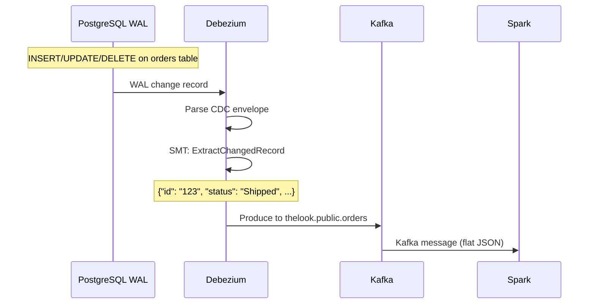

# Datasource — CDC Pipeline

## End-to-End Flow

```
PostgreSQL (WAL)
    │  pgoutput plugin
    ▼
Debezium Connector (ExtractChangedRecord SMT)
    │  Unwraps CDC envelope → flat JSON
    ▼
Apache Kafka (thelook.public.*)
    │  7 topics
    ▼
Spark Structured Streaming (notebook cell 6)
    │  from_json() with StructType, write to Delta
    ▼
Delta Lake s3a://lakehouse/staging/
```

## PostgreSQL Source

| Table | CDC? | Description |
|-------|------|-------------|
| `orders` | Yes | Order header with status lifecycle |
| `order_items` | Yes | Line items per order |
| `events` | Yes | Web/app session events |
| `users` | Yes | User registrations |
| `products` | Initial | Product catalog (static) |
| `dist_centers` | Initial | Distribution centers (static) |
| `heartbeat` | Yes | WAL keepalive (prevents slot growth) |

### WAL Configuration

```bash
wal_level=logical          # Enable logical replication
max_replication_slots=4    # One per CDC table + heartbeat
max_wal_senders=4
```

## Debezium Connector

**Config:** `infra/debezium/conf/thelook-postgres.json`

### How CDC Works



### Key Connector Settings

```json
{
  "connector.class": "io.debezium.connector.postgresql.PostgresConnector",
  "plugin.name": "pgoutput",
  "database.hostname": "postgres",
  "database.dbname": "thelook",
  "topic.prefix": "thelook",
  "slot.name": "debezium_thelook_slot",
  "publication.name": "debezium_thelook_pub",
  "snapshot.mode": "initial",
  "transforms": "unwrap",
  "transforms.unwrap.type": "io.debezium.transforms.ExtractChangedRecordState",
  "value.converter": "org.apache.kafka.connect.json.JsonConverter",
  "value.converter.schemas.enable": "false"
}
```

### SMT: ExtractChangedRecordState

The SMT unwraps the Debezium CDC envelope. Before SMT, each Kafka message looks like:

```json
{
  "before": null,
  "after": {"id": "123", "status": "Processing", "user_id": "456", ...},
  "op": "c",
  "ts_ms": 1712345678901
}
```

After SMT (`ExtractChangedRecord`), the wire format is **flat JSON** — no `before`, `after`, `op`, or `ts_ms`:

```json
{"id": "123", "status": "Processing", "user_id": "456", ...}
```

This flat JSON is what Spark parses with `from_json()`.

### Heartbeat

```json
"heartbeat.interval.ms": "10000",
"heartbeat.action.query": "INSERT INTO public.heartbeat (id, ts) VALUES (1, NOW()) ON CONFLICT (id) DO UPDATE SET ts = NOW()"
```

Inserts a heartbeat row every 10 seconds if no CDC events occur. This keeps the replication slot active and prevents WAL from growing unbounded.

## Kafka Topics

| Topic | Partitioned by | Notes |
|-------|---------------|-------|
| `thelook.public.orders` | `id` | Order lifecycle events |
| `thelook.public.order_items` | `order_id` | Line item changes |
| `thelook.public.events` | `id` | Web/app events |
| `thelook.public.users` | `id` | User registrations |
| `thelook.public.products` | `id` | Initial catalog load |
| `thelook.public.dist_centers` | `id` | Initial DC load |
| `thelook.public.heartbeat` | `id` | Keepalive messages |

Topic naming: `{topic.prefix}.{schema}.{table}`.

## Spark Streaming (Notebook Cell 6)

### Read from Kafka

```python
stream = (
    spark.readStream
        .format("kafka")
        .option("kafka.bootstrap.servers", "kafka:9092")
        .option("subscribe", "thelook.public.events")
        .option("startingOffsets", "latest")      # ← Use "latest" to avoid duplicates
        .load()
)
```

### Parse Flat JSON

```python
parsed = (
    stream
        .select(F.from_json(F.col("value").cast("string"), event_schema).alias("data"))
        .select("data.*")                        # flatten into typed columns
)
```

### Write to Delta with Checkpoint

```python
query = (
    parsed.writeStream
        .format("delta")
        .option("checkpointLocation", "s3a://lakehouse/checkpoints/events")
        .trigger(processingTime="30 seconds")
        .outputMode("append")
        .toTable("staging.events")
)
```

| Option | Value | Purpose |
|--------|-------|---------|
| `startingOffsets` | `latest` | Resume from last committed offset — no duplicates |
| `checkpointLocation` | `s3a://lakehouse/checkpoints/{table}` | Stores Kafka offsets for exactly-once semantics |
| `trigger` | `30 seconds` | Micro-batch processing interval |
| `outputMode` | `append` | Append new records — dedup handled by dbt |

## Stream Restart & Duplicates

> **Warning:** If notebook restarts with `startingOffsets: "earliest"`, Kafka re-reads from the beginning. Combined with `append` output mode, this **accumulates duplicates**.

**Prevention:** Always use `startingOffsets: "latest"` for production streams.

**Recovery if duplicates exist:**

```sql
-- Truncate before restart with earliest
TRUNCATE TABLE delta.staging.events;
```

## Ghost Events

Events with `user_id IS NULL` are valid anonymous browsing sessions. They are:
- Written to `staging.events` normally
- Flagged `is_ghost=true` in `intermediate_events`
- Excluded from `fct_sessions` (sessions need a user)
- Included in raw `fct_events` counts
