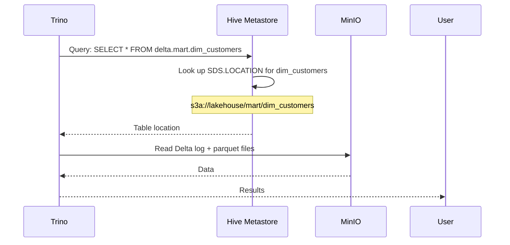

# Trino — Query Engine

## Role

Trino is the SQL query engine for Delta Lake. It federates queries across all three medallic schemas (`staging`, `intermediate`, `mart`) by reading table metadata from Hive Metastore.

## Configuration

**Config:** `infra/trino/conf/catalog/delta.properties`

```properties
connector.name=delta_lake
hive.metastore.uri=thrift://hive-metastore:9083
fs.native-s3.enabled=true
s3.aws-access-key=minio
s3.aws-secret-key=minio123
s3.endpoint=http://minio:9000
s3.region=us-east-1
s3.path-style-access=true
delta.register-table-procedure.enabled=true
```

| Setting | Value | Purpose |
|---------|-------|---------|
| `connector.name` | `delta_lake` | Trino's native Delta Lake connector |
| `hive.metastore.uri` | `thrift://hive-metastore:9083` | HMS endpoint for table metadata |
| `s3.endpoint` | `http://minio:9000` | Points to local MinIO, not AWS |
| `s3.path-style-access` | `true` | Required for MinIO |
| `delta.register-table-procedure.enabled` | `true` | Enables `CALL delta.system.register_table()` |

> MinIO credentials are hardcoded in `delta.properties`. Do NOT add env-substitution entrypoint scripts — Trino reads config at startup and won't substitute env vars.

## HMS Integration



Trino relies on HMS `SDS.LOCATION` column to find table data. If HMS has wrong location → error.

## Schema Path Alignment

Trino auto-creates schemas at `s3a://lakehouse/warehouse/{schema}.db/`. HMS stores that path. But notebook writes to `s3a://lakehouse/{schema}/`.

> If HMS says `warehouse/` but data is at `lakehouse/` → `DELTA_LAKE_INVALID_SCHEMA: Metadata not found`.

**Solution:** Both notebook and dbt use explicit `location` paths:

```sql
CREATE SCHEMA IF NOT EXISTS staging WITH (location = 's3a://lakehouse')
CREATE SCHEMA IF NOT EXISTS intermediate WITH (location = 's3a://lakehouse')
CREATE SCHEMA IF NOT EXISTS mart WITH (location = 's3a://lakehouse')
```

## Schema Map

| Trino path | MinIO path | Contents | Owner |
|-----------|------------|---------|-------|
| `delta.staging` | `s3a://lakehouse/staging/` | Raw CDC tables | Notebook (HMS registration) |
| `delta.intermediate` | `s3a://lakehouse/intermediate/` | Deduplicated, enriched | dbt (auto-registers) |
| `delta.mart` | `s3a://lakehouse/mart/` | Dims + facts | dbt (auto-registers) |

## dbt Profile

`infra/dbt/profiles.yml`:

```yaml
thelook_trino:
  target: dev
  outputs:
    dev:
      type: trino
      method: none
      host: "{{ env_var('TRINO_HOST', 'trino') }}"
      port: "{{ env_var('TRINO_PORT', '8080') | int }}"
      user: trino
      database: delta
      schema: silver         # Default — overridden by +schema config
      threads: 4
```

The `schema: silver` default is overridden per-model by `+schema` in `dbt_project.yml`.

## Querying via Trino CLI

```bash
# Enter container
docker compose exec trino trino

# List catalogs
trino> SHOW CATALOGS;

# List schemas
trino> SHOW SCHEMAS IN delta;

# List tables
trino> SHOW TABLES IN delta.staging;
trino> SHOW TABLES IN delta.intermediate;
trino> SHOW TABLES IN delta.mart;

# Sample queries
trino> SELECT COUNT(*) FROM delta.staging.events;
trino> SELECT COUNT(*) FROM delta.intermediate.events;
trino> SELECT customer_tier, COUNT(*) FROM delta.mart.dim_customers GROUP BY 1;
trino> SELECT DATE(date_iso) AS day, SUM(total_revenue) FROM delta.mart.fct_orders GROUP BY 1 ORDER BY 1 DESC LIMIT 7;
```

## Troubleshooting

### Error: `DELTA_LAKE_INVALID_SCHEMA: Metadata not found for schema 'intermediate'`

**Cause:** HMS `SDS.LOCATION` points to `s3a://lakehouse/warehouse/intermediate.db/` but no Delta files exist there.

**Fix:**
```sql
-- Drop stale schema
DROP SCHEMA IF EXISTS intermediate;

-- Recreate with correct path
CREATE SCHEMA intermediate WITH (location = 's3a://lakehouse');
```

Or run `dbt run` — the `on-run-start` hook recreates all schemas with correct paths.

### Error: `Table not found`

**Cause:** HMS has no metadata for the table (notebook wasn't running when data was written).

**Fix:**
```sql
-- Re-register via notebook cell 5, or manually:
CALL delta.system.register_table(
    'delta',
    'staging',
    'events',
    's3a://lakehouse/staging/events'
);
```

## MinIO S3A Tuning

HMS's `core-site.xml` is tuned for MinIO performance:

| Property | Value | Purpose |
|----------|-------|---------|
| `fs.s3a.connection.timeout` | 200s | Socket connection timeout |
| `fs.s3a.socket.timeout` | 200s | Socket I/O timeout |
| `fs.s3a.threads.max` | 96 | Max S3A thread pool |
| `fs.s3a.multipart.size` | 64MB | Multipart upload part size |
| `fs.s3a.change.detection.mode` | none | Disable change detection |
